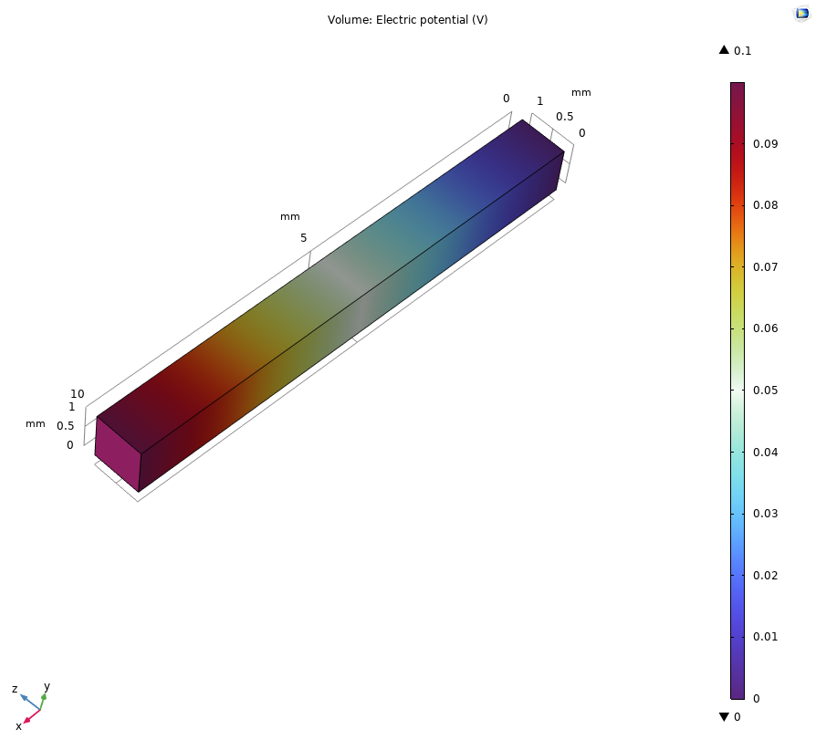
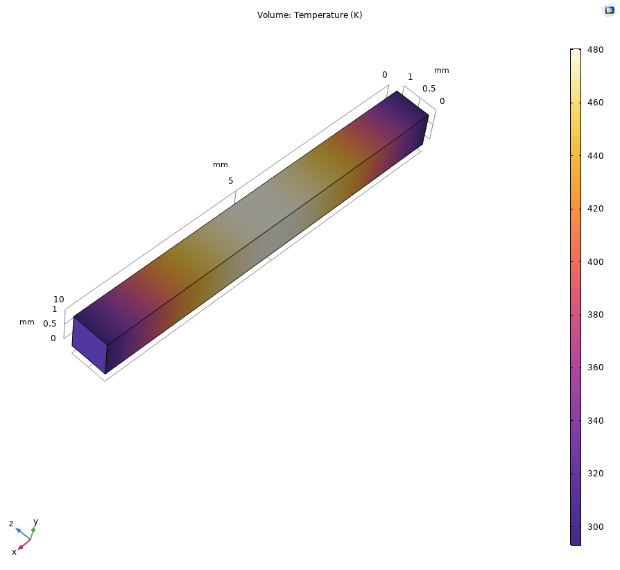

# Project 1: Joule Heating Validation (Steady State)

## 1. Overview
This project simulates the electro-thermal coupling (Joule Heating) of a copper micro-resistor. The objective is to validate the COMSOL Multiphysics `Electromagnetic Heating` interface against an analytical conservation of energy calculation.

**Physics Interfaces:** `Electric Currents (ec)`, `Heat Transfer in Solids (ht)`
**Study Type:** Stationary (Steady State)

## 2. Governing Equations
The simulation solves the coupled system of partial differential equations for electric potential ($V$) and temperature ($T$).

**1. Current Conservation (Ohm's Law):**
$$\nabla \cdot \mathbf{J} = 0$$
$$\mathbf{J} = \sigma \mathbf{E} = -\sigma \nabla V$$

**2. Heat Equation (Steady State):**
$$-k \nabla^2 T = Q_{source}$$

**3. The Multiphysics Coupling:**
The heat source $Q_{source}$ is the resistive loss defined by the dot product of current density and electric field:
$$Q_{source} = \mathbf{J} \cdot \mathbf{E} = \sigma |\nabla V|^2$$

## 3. Model Setup
* **Geometry:** $10 \text{ mm} \times 1 \text{ mm} \times 1 \text{ mm}$ Rectangular Block.
* **Material:** Copper ($\sigma = 5.998 \times 10^7 \text{ S/m}$).
* **Boundary Conditions:**
    * Voltage: $0.1 \text{ V}$ (Right Face), Ground (Left Face).
    * Temperature: Fixed $293.15 \text{ K}$ at both ends (Heat Sink).

## 4. Validation Results
We compared the numerical integration of total dissipated power density (`ec.Q_tot`) against the analytical power formulation $P = V^2/R$.

| Parameter | Analytical (Hand Calc) | COMSOL Simulation | Error (%) |
| :--- | :--- | :--- | :--- |
| **Total Power (W)** | **60.00 W** | **59.88 W** | **0.2%** |

## 5. Visualizations

*Figure 1: Electric Potential distribution showing linear voltage drop.*

*Figure 2: Temperature profile showing peak heating in the center (Parabolic profile).*
